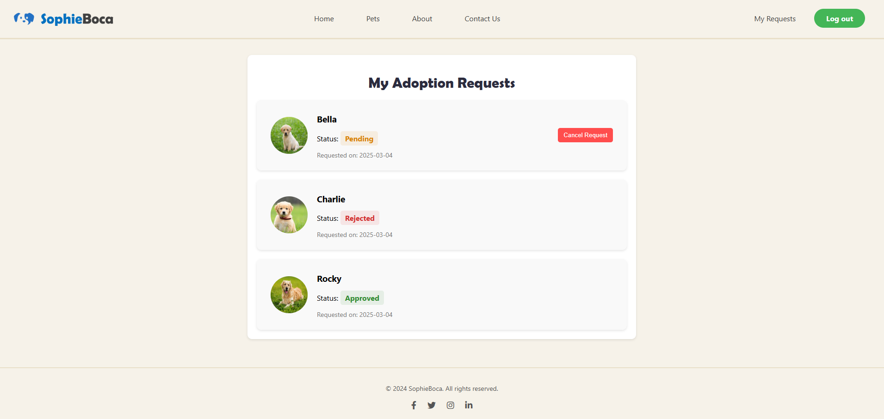

# SophieBoca - Dog Adoption Website

## Part A

### Project Overview
SophieBoca is a user-friendly platform aimed at connecting people interested in adopting dogs with shelters, foster homes, and animal associations. Our mission is to make the adoption process accessible and efficient for both adopters and organizations, encouraging lasting bonds between dogs and their new families.

### Screenshots

| **Home Page** | **Dogs Page** |
| --- | --- |
|  |  |

 ---
 #   Part C

## Project Overview
• We have the "Reserve Group 3" relief so we focuses on implementing a core process on the website: **the adoption request process**. Following discussions with Arseni, we decided to implement this process even though it spans more than three pages. The process flow includes:

**Homepage** -> **Registration** -> **Login** -> **Dogs Page (With Filters)** -> **Dog Information Page** -> **Adoption Request** -> **My Requests Management**


Other pages such as association management, about us, and contact were not implemented as per the allowed permissions.

We used encryption when registering the user, and therefore, the password cannot be retrieved through `analyzeDB`. You can register and use the platform as usual or log in with the following credentials:

- **Username:** gome@gmail.com
- **Password:** Gg12345678

## Project Folder Structure
The project follows a structured **skeleton model**, organizing files into relevant folders. The key folders include:

```
project_root/
│── app.py            # Main application entry point
│── analyzeDB.py      # Script to analyze database contents
│── db_connector.py   # Handles database connection and queries
│── pages/            # Contains blueprints for different sections
│   ├── dog_info/     # Dog details page
│   ├── homepage/     # Homepage logic
│   ├── login/        # Login and authentication
│   ├── my_requests/  # Adoption request management
│   ├── pets/         # Pet listing and filtering
│   ├── sign_up/      # User registration page
│── templates/        # HTML templates using Jinja
│── static/           # Static files (CSS, JS, media)
│── venv/             # Virtual environment for dependencies
```

## Handling Requests to the Routing Line
The Flask application handles routing using blueprints. Each page has its own route definition. Example routes:

```python
@homepage.route('/')
def index():
    return render_template("homepage.html", active_page="homepage")

@pets.route("/pets")
def index():
    return render_template("pets.html", active_page="pets", dogs=dogs, gender_icons=gender_icons)
```

## Database Connection and Queries (MongoDB)
The project interacts with a MongoDB database to store and retrieve adoption-related data. Below are examples (parts of the code) of queries used:

### Insert Query
```python 
        adoption_request = {
            "user_email": user_email,
            "dog_id": dog_id,
            "dog_name": dog["name"],
            "photo": dog.get("photos", ["default.png"])[0],
            "status": "Pending",
            "request_date": datetime.today().strftime("%Y-%m-%d")
        }
        
        requests_col.insert_one(adoption_request)
```

### Update Query
```python
    request_id = request.json.get('request_id')
    if not request_id:
        return jsonify({"error": "Missing request_id"}), 400
    
    try:
        object_id = ObjectId(request_id)
        result = requests_col.update_one({"_id": object_id}, {"$set": {"status": "Cancelled"}})
```

### Delete Query
```python
    request_id = request.json.get('request_id')
    if not request_id:
        return jsonify({"error": "Missing request_id"}), 400
    
    try:
        object_id = ObjectId(request_id)
        result = requests_col.delete_one({"_id": object_id, "status": "Cancelled"})
```

### Find Query (Login User)
```python
    data = request.get_json()
    email = data.get('email')
    password = data.get('password')
    
    user = adopters_col.find_one({"email": email})
    if not user or not check_password_hash(user["password"], password):
        return jsonify({"success": False, "message": "Invalid credentials."}), 401
```

### Find Query with Filters (Dog Search)
```python
@pets.route("/pets", methods=["GET"])
def index():
    query = {}
    if request.args.get("breed"):
        query["breed"] = request.args["breed"]
    if request.args.get("size"):
        query["size"] = request.args["size"].lower()
    if request.args.get("gender"):
        query["sex"] = request.args["gender"].lower()
    
    dogs = list(dogs_col.find(query))
    for dog in dogs:
        dog["_id"] = str(dog["_id"])
        dog["photo"] = dog.get("photos", ["default.png"])[0]
        dog["age_category"] = get_age_category(dog.get("date_of_birth"))
    
    return render_template("pets.html", dogs=dogs)
```

## Jinja Templating
All HTML pages were converted into Jinja templates to make them dynamic and reusable. Example:

```html



    <h1>Welcome to the Adoption Center</h1>
    
        <div class="dog-card">
            
            <p>{{ dog.name }} - {{ gender_icons[dog.gender] | safe }}</p>
        </div>
    

```


 
